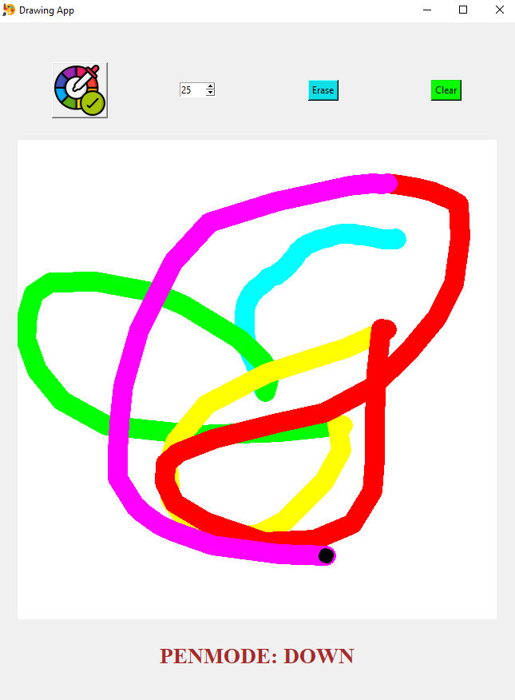

# Drawing-App
A fully functioning app with which you can draw using different colors and thicknesses. You can even ERASE or CLEAR your drawings too!
# Installation
#### NO EXTERNAL LIBRARIES NEEDED!
# Usage
- Drag the Circle to Draw.
- Choose COLOR 🎨 and THICKNESS using the Comboboxes.
- Click ERASE to erase, and click it again to turn it off.
- Click CLEAR to erase your entire drawing.
- Use PEN UP and PEN DOWN if you want to move your cursor(circle) to a different position without drawing.
# Preview

